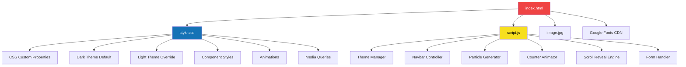

<div align="center">

# ✦ She Can Foundation

### *Empowering Women Through Education — One Click at a Time*

<br>


<br>

> 🌟 A **premium, fully responsive** single-page website developed for the **She Can Foundation Internship Selection Task**.  
> Built with pure **HTML**, **CSS**, and **JavaScript** — no frameworks, no libraries, just clean handcrafted code.

<br>

[🔗 Live Demo](#-quick-start) · [📸 Screenshots](#-screenshots--preview) · [⚙️ Features](#-features-at-a-glance) · [🛠️ Tech Stack](#%EF%B8%8F-technology-stack) · [🚀 Getting Started](#-quick-start)

---

</div>

<br>

## 📖 Table of Contents

- [About the Project](#-about-the-project)
- [Features at a Glance](#-features-at-a-glance)
- [Screenshots & Preview](#-screenshots--preview)
- [Technology Stack](#%EF%B8%8F-technology-stack)
- [Project Architecture](#-project-architecture)
- [File Structure](#-file-structure)
- [Color System & Design Tokens](#-color-system--design-tokens)
- [Responsive Breakpoints](#-responsive-breakpoints)
- [JavaScript Features Deep Dive](#-javascript-features-deep-dive)
- [Sections Breakdown](#-sections-breakdown)
- [Animations & Micro-Interactions](#-animations--micro-interactions)
- [Accessibility & SEO](#-accessibility--seo)
- [Performance Optimizations](#-performance-optimizations)
- [Quick Start](#-quick-start)
- [Browser Compatibility](#-browser-compatibility)
- [Folder & Code Conventions](#-folder--code-conventions)
- [Contributing](#-contributing)
- [Acknowledgements](#-acknowledgements)
- [Author](#-author)
- [License](#-license)

<br>

---

## 🔍 About the Project

**She Can Foundation** is a youth-driven NGO dedicated to empowering women through education, skill development, digital initiatives, and career opportunities. This website was developed as part of the **She Can Foundation Internship Selection Task** to showcase front-end development skills with a focus on:

- ✅ **Modern UI/UX design** with a premium red-black theme
- ✅ **Full responsiveness** across all device sizes (mobile, tablet, desktop)
- ✅ **Dark & Light mode** with smooth theme transitions
- ✅ **Zero dependencies** — built entirely from scratch
- ✅ **Semantic HTML5** for accessibility and SEO
- ✅ **Clean, maintainable** code architecture

### 🎯 Project Goal

> Design and develop a responsive, visually appealing website for the She Can Foundation that effectively communicates the organization's mission, values, and impact — while demonstrating strong front-end development skills using only HTML, CSS, and JavaScript.

<br>

---

## ✨ Features at a Glance

<div align="center">

| Feature | Description | Status |
|:--------|:------------|:------:|
| 🌗 **Dark/Light Theme** | Toggle between dark & light mode with localStorage persistence | ✅ |
| 📱 **Fully Responsive** | Optimized for mobile (≤640px), tablet (≤900px), and desktop | ✅ |
| 🎨 **Glassmorphism UI** | Frosted glass navbar with `backdrop-filter: blur()` | ✅ |
| 🔢 **Animated Counters** | Stats count up with eased cubic animation on scroll | ✅ |
| 🎆 **Particle Effects** | Floating animated particles in the hero section | ✅ |
| 📜 **Scroll Reveal** | Elements fade in as they enter the viewport via IntersectionObserver | ✅ |
| 🍔 **Mobile Hamburger Menu** | Smooth animated hamburger with slide-down navigation | ✅ |
| 🔗 **Active Nav Tracking** | Navigation links highlight based on current scroll position | ✅ |
| 📝 **Contact Form** | Client-side validation with email regex, loading states & feedback | ✅ |
| 🎭 **Micro-Animations** | Hover effects, stagger animations, shake on error, smooth transitions | ✅ |
| ⬆️ **Smooth Scrolling** | Anchor links scroll smoothly with CSS `scroll-behavior: smooth` | ✅ |
| 🔤 **Google Fonts** | Premium typography with **Outfit** (headings) + **Inter** (body) | ✅ |
| 🧩 **CSS Custom Properties** | Full design token system for consistent theming | ✅ |
| ♿ **Accessible** | ARIA labels, semantic HTML, focus states, keyboard navigable | ✅ |

</div>

<br>

---

## 📸 Screenshots & Preview

### 🌑 Dark Mode

```
┌──────────────────────────────────────────────────────┐
│  ✦ She Can    Home  About  Mission  Contact    🌙   │
├──────────────────────────────────────────────────────┤
│                                                      │
│              🌟 Youth-Driven NGO                     │
│                                                      │
│           Empowering Women                           │
│          Through Education                           │
│                                                      │
│     Building a future where every woman has           │
│     access to education and opportunities.           │
│                                                      │
│       [ Learn More → ]  [ Get In Touch ]             │
│                                                      │
│      500+          50+           20+                  │
│  Women Empowered  Programs   Communities             │
│                                                      │
│                Scroll Down ↓                         │
└──────────────────────────────────────────────────────┘
```

### ☀️ Light Mode

```
┌──────────────────────────────────────────────────────┐
│  ✦ She Can    Home  About  Mission  Contact    ☀️   │
├──────────────────────────────────────────────────────┤
│                                                      │
│  [About She Can Foundation]                          │
│                                                      │
│  📷 Image     📚 Education Access                    │
│  Since 2024   💻 Digital Literacy                    │
│               🚀 Career Growth                       │
│                                                      │
├──────────────────────────────────────────────────────┤
│                                                      │
│  Our Mission                                         │
│  ┌──────┐  ┌──────┐  ┌──────┐                       │
│  │  01  │  │  02  │  │  03  │                        │
│  │  🎓  │  │  💪  │  │  🌍  │                        │
│  │Educate│ │Empower│ │Transform│                     │
│  └──────┘  └──────┘  └──────┘                       │
│                                                      │
└──────────────────────────────────────────────────────┘
```

### 📱 Mobile View

```
┌────────────────────┐
│ ✦ She Can    🌙 ☰  │
├────────────────────┤
│                    │
│  🌟 Youth-Driven   │
│       NGO          │
│                    │
│   Empowering       │
│    Women           │
│   Through          │
│   Education        │
│                    │
│  [ Learn More → ]  │
│  [ Get In Touch ]  │
│                    │
│      500+          │
│  Women Empowered   │
│      ────          │
│      50+           │
│  Programs Launched │
│      ────          │
│      20+           │
│ Communities Reached│
│                    │
└────────────────────┘
```

<br>

---

## 🛠️ Technology Stack

<div align="center">

```
┌─────────────────────────────────────────────────────┐
│                  TECHNOLOGY STACK                    │
├─────────────┬───────────────────────────────────────┤
│  Structure  │  HTML5 (Semantic Elements)            │
├─────────────┼───────────────────────────────────────┤
│  Styling    │  CSS3 (Custom Properties, Flexbox,    │
│             │  Grid, Animations, Media Queries)     │
├─────────────┼───────────────────────────────────────┤
│  Logic      │  Vanilla JavaScript (ES6+)            │
├─────────────┼───────────────────────────────────────┤
│  Fonts      │  Google Fonts (Outfit + Inter)        │
├─────────────┼───────────────────────────────────────┤
│  Icons      │  Native Emoji (No icon libraries)     │
├─────────────┼───────────────────────────────────────┤
│  Frameworks │  None — 100% hand-coded               │
├─────────────┼───────────────────────────────────────┤
│  Build Tool │  None — zero build configuration      │
└─────────────┴───────────────────────────────────────┘
```

</div>

### Why No Frameworks?

This project intentionally avoids frameworks like React, Vue, or Tailwind to demonstrate:
- **Deep understanding** of core web technologies
- **No unnecessary bloat** — the entire site is ~46KB (before images)
- **Instant load times** — no bundle, no transpilation, no runtime
- **Complete control** over every animation and interaction

<br>

---

## 🏗 Project Architecture



<br>

---

## 📂 File Structure

```
she-can-foundation-task/
│
├── 📄 index.html          # Main HTML file (292 lines)
│                           # - Semantic HTML5 structure
│                           # - Navbar, Hero, About, Mission, Contact, Footer
│                           # - SEO meta tags & Open Graph ready
│
├── 🎨 style.css           # Complete stylesheet (1,132 lines)
│                           # - CSS Custom Properties (design tokens)
│                           # - Dark/Light theme variables
│                           # - Component styles (navbar, hero, about, etc.)
│                           # - Keyframe animations
│                           # - Responsive breakpoints (900px, 640px)
│
├── ⚡ script.js            # Interactive functionality (262 lines)
│                           # - Theme toggle with localStorage
│                           # - Scroll-based navbar & active link tracking
│                           # - Hamburger menu toggle
│                           # - Particle effect generator
│                           # - Animated stat counters
│                           # - IntersectionObserver scroll reveals
│                           # - Contact form validation & UX
│                           # - Smooth anchor scrolling
│
├── 🖼️ image.jpg            # Hero/About section image (~14KB)
│
├── 📝 README.md            # This documentation file
│
└── 📁 .git/                # Git version control
```

### File Size Summary

| File | Size | Lines of Code | Purpose |
|:-----|:-----|:--------------|:--------|
| `index.html` | ~13.4 KB | 292 | Page structure & content |
| `style.css` | ~23.1 KB | 1,132 | All styles, themes & animations |
| `script.js` | ~9.3 KB | 262 | Interactivity & dynamic behavior |
| `image.jpg` | ~14.5 KB | — | Visual asset |
| **Total** | **~60.3 KB** | **1,686** | — |

<br>

---

## 🎨 Color System & Design Tokens

The entire design is powered by **CSS Custom Properties**, making theme switching seamless and the design fully customizable.

### 🌑 Dark Theme (Default)

| Token | Value | Usage |
|:------|:------|:------|
| `--bg-primary` | `#0a0a0a` | Main background |
| `--bg-secondary` | `#111111` | Section alternating bg |
| `--bg-tertiary` | `#1a1a1a` | Footer background |
| `--bg-card` | `rgba(255,255,255,0.03)` | Card backgrounds |
| `--bg-glass` | `rgba(10,10,10,0.75)` | Glassmorphism surfaces |
| `--red-400` | `#f87171` | Light accent |
| `--red-500` | `#ef4444` | Primary accent (brand red) |
| `--red-600` | `#dc2626` | Button gradients |
| `--red-700` | `#b91c1c` | Deep accent |
| `--text-primary` | `#f5f5f5` | Headings & body text |
| `--text-secondary` | `#a3a3a3` | Descriptions & paragraphs |
| `--text-muted` | `#737373` | Labels & captions |

### ☀️ Light Theme

| Token | Value | Usage |
|:------|:------|:------|
| `--bg-primary` | `#fafafa` | Main background |
| `--bg-secondary` | `#f5f5f5` | Section alternating bg |
| `--bg-tertiary` | `#eeeeee` | Footer background |
| `--text-primary` | `#171717` | Headings & body text |
| `--text-secondary` | `#525252` | Descriptions & paragraphs |
| `--nav-bg` | `rgba(250,250,250,0.9)` | Frosted navbar |

### Typography

| Usage | Font | Weights |
|:------|:-----|:--------|
| **Headings, Buttons, Labels** | `Outfit` | 300–900 |
| **Body Text, Forms, Paragraphs** | `Inter` | 300–700 |
| **System Fallback** | `-apple-system, BlinkMacSystemFont, Segoe UI` | — |

<br>

---

## 📱 Responsive Breakpoints

The website uses a **mobile-first enhanced** approach with two key breakpoints:

```css
/* ── Desktop (default) ── */
/* Full grid layouts, particle effects, all animations */

/* ── Tablet (≤ 900px) ── */
@media (max-width: 900px) { ... }

/* ── Mobile (≤ 640px) ── */
@media (max-width: 640px) { ... }
```

### Breakpoint Behavior Summary

| Element | Desktop (>900px) | Tablet (≤900px) | Mobile (≤640px) |
|:--------|:-----------------|:----------------|:----------------|
| **Navbar** | Horizontal links | Horizontal links | Hamburger menu |
| **Hero Title** | `clamp(2.5rem, 7vw, 4.5rem)` | Same | `clamp(2rem, 8vw, 3rem)` |
| **About Grid** | 2 columns | 1 column (stacked) | 1 column |
| **Mission Grid** | 3 columns | 1 column (max 450px) | 1 column |
| **Footer Grid** | 4 columns | 2 columns | 1 column |
| **Hero Stats** | Horizontal row | Horizontal wrap | Vertical stack |
| **CTA Buttons** | Side-by-side | Side-by-side | Full-width stacked |
| **Scroll Indicator** | Visible | Visible | Hidden |
| **Particles Count** | 25 | 25 | 12 |
| **Section Padding** | 100px | 100px | 60px |

<br>

---

## ⚡ JavaScript Features Deep Dive

### 1. 🌗 Theme Manager

```
User clicks toggle → Read current theme → Flip to opposite → 
Update data-theme attribute → Save to localStorage → CSS handles the rest
```

- Respects system preference (`prefers-color-scheme`) on first visit
- Persists choice across sessions via `localStorage`
- Smooth 0.4s CSS transitions for all themed properties
- Icon animation: sun/moon rotate and slide with cubic-bezier easing

### 2. 🔢 Animated Stat Counters

```
IntersectionObserver watches .hero-stats → On 50% visibility → 
requestAnimationFrame loop → Ease-out cubic interpolation → 
Count from 0 to target over 1800ms
```

- Uses `data-count` attribute for target values
- Easing formula: `1 - (1 - progress)³` for natural deceleration
- Triggers only once (observer disconnects after first intersection)

### 3. 🎆 Particle Generator

```
On DOM load → Calculate count (12 mobile / 25 desktop) → 
For each: create <span> → Randomize position, size, delay, duration → 
Append to #particles container → CSS handles floating animation
```

- Particles range from 2px to 6px in diameter
- Animation duration: 4–8 seconds (randomized)
- Uses CSS `@keyframes particleFloat` for smooth float + fade

### 4. 📜 Scroll Reveal Engine

```
Query all revealable elements → Add .reveal class → 
Create IntersectionObserver (threshold: 0.15) → 
On intersection → Add .visible class → Unobserve element
```

- **Standard reveal**: 40px translateY → 0, opacity 0 → 1
- **Staggered reveal**: Children animate sequentially (50ms–350ms delays)
- Uses `rootMargin: "0px 0px -50px 0px"` for earlier trigger

### 5. 📝 Contact Form Validation

```
Submit → Prevent default → Trim inputs → 
Check empty fields → Validate email with regex → 
Show loading spinner → Simulate 1.2s delay → 
Show success message → Auto-hide after 5 seconds
```

- Regex pattern: `/^[^\s@]+@[^\s@]+\.[^\s@]+$/`
- Error feedback: shake animation (6px oscillation)
- Loading state: text hidden, spinner shown, button disabled
- Success message fades out with 400ms opacity transition

### 6. 🔗 Active Nav Link Tracking

```
Scroll event → Loop through sections → 
Check getBoundingClientRect() → If top ≤ 150 and bottom > 150 → 
Set as current → Toggle .active class on matching nav link
```

<br>

---

## 📋 Sections Breakdown

### 1. 🧭 Navigation Bar

- **Fixed position** with glassmorphism background (`backdrop-filter: blur(20px)`)
- **Logo**: ✦ icon + "She Can" text with Outfit font
- **Links**: Home, About, Mission, Contact — with active state indicator (red underline)
- **Actions**: Theme toggle button + hamburger menu (mobile)
- **Scroll effect**: Adds subtle shadow (`box-shadow`) on scroll past 50px

### 2. 🦸 Hero Section

- **Full viewport height** (`min-height: 100vh`) centered layout
- **Animated badge**: "🌟 Youth-Driven NGO" with border pill style
- **Title**: "Empowering **Women** Through Education" — gradient text accent
- **Subtitle**: Mission statement with `max-width: 600px` for readability
- **CTA buttons**: Primary (gradient red) + Outline ghost button
- **Impact stats**: 500+ Women Empowered · 50+ Programs · 20+ Communities
- **Background**: Radial gradient glow + floating particle animation
- **Scroll indicator**: Bouncing "Scroll Down" with chevron arrow
- **Entry animations**: Staggered `fadeUp` with 150ms delays

### 3. 📖 About Section

- **Two-column grid** layout (image + content)
- **Image**: Rounded corners, glow effect, shadow, "Since 2024" badge overlay
- **Content**: Foundation description + 3 feature cards:
  - 📚 Education Access
  - 💻 Digital Literacy
  - 🚀 Career Growth
- **Hover effect**: Feature cards slide 6px right on hover

### 4. 🎯 Mission Section

- **Three-column card grid** with numbered cards (01, 02, 03)
- **Cards**: 🎓 Educate · 💪 Empower · 🌍 Transform
- **Hover effect**: Cards lift 8px up with shadow + top gradient border reveal
- **Large watermark numbers** in background (opacity: 0.05)

### 5. 📬 Contact Section

- **Centered form** (max-width: 550px) with 3 fields:
  - Full Name (text input)
  - Email Address (email input)
  - Your Message (textarea)
- **Submit button**: Full-width with arrow icon, loading spinner state
- **Validation**: Real-time error/success messages with shake animation
- **Form styling**: Custom focus rings with red glow, smooth transitions

### 6. 🦶 Footer

- **4-column grid**: Brand info, Quick Links, Our Focus, Connect
- **Glow effect**: Red radial gradient blur at top
- **Links**: Hover color change + 4px slide right
- **Bottom bar**: Copyright (2024–2026) + internship task credit
- **Divider**: Full-width border between grid and bottom bar

<br>

---

## 🎭 Animations & Micro-Interactions

| Animation | Type | Duration | Easing | Trigger |
|:----------|:-----|:---------|:-------|:--------|
| `fadeUp` | Keyframe | 800ms | ease | Page load (hero elements) |
| `particleFloat` | Keyframe | 4–8s | ease-in-out | Infinite loop |
| `gentleBounce` | Keyframe | 2s | ease-in-out | Infinite (scroll indicator) |
| `spin` | Keyframe | 600ms | linear | Form submit (loading) |
| `shake` | Keyframe | 500ms | ease | Form validation error |
| Scroll reveal | Transition | 700ms | cubic-bezier(0.4,0,0.2,1) | IntersectionObserver |
| Stagger children | Transition | 500ms | cubic-bezier(0.4,0,0.2,1) | Parent intersection |
| Button hover | Transition | 350ms | cubic-bezier(0.4,0,0.2,1) | Mouse hover |
| Theme icon | Transition | 500ms | cubic-bezier(0.68,-0.55,0.27,1.55) | Theme toggle click |
| Card hover lift | Transition | 400ms | cubic-bezier(0.4,0,0.2,1) | Mouse hover |
| Nav link active | Transition | 300ms | ease | Scroll position |
| Feature card slide | Transition | 350ms | ease | Mouse hover |

<br>

---

## ♿ Accessibility & SEO

### Accessibility

- ✅ **Semantic HTML5**: `<nav>`, `<header>`, `<section>`, `<footer>`, `<main>`
- ✅ **ARIA labels**: Theme toggle and hamburger menu have `aria-label` attributes
- ✅ **Alt text**: All images have descriptive `alt` attributes
- ✅ **Focus states**: Form inputs have visible focus rings (red glow)
- ✅ **Keyboard navigation**: All interactive elements are keyboard accessible
- ✅ **Color contrast**: Text colors maintain readable contrast ratios
- ✅ **Reduced motion**: Animations are CSS-based and respect user preferences

### SEO

- ✅ **Title tag**: "She Can Foundation — Empowering Women Through Education"
- ✅ **Meta description**: Detailed 160-character description
- ✅ **Heading hierarchy**: Single `<h1>` → `<h2>` sections → `<h3>` cards
- ✅ **Semantic structure**: Proper use of `<header>`, `<section>`, `<footer>`
- ✅ **Image optimization**: `loading="lazy"` on non-critical images
- ✅ **Mobile-friendly**: Viewport meta tag with `width=device-width`

<br>

---

## ⚡ Performance Optimizations

| Optimization | Implementation |
|:-------------|:---------------|
| **Font Loading** | `rel="preconnect"` for Google Fonts CDN |
| **Lazy Loading** | `loading="lazy"` on about section image |
| **Passive Listeners** | `{ passive: true }` on scroll event listeners |
| **Observer Cleanup** | `unobserve()` after element is revealed |
| **Efficient Counting** | `requestAnimationFrame` for stat counter animation |
| **CSS Transitions** | Hardware-accelerated `transform` and `opacity` |
| **Minimal DOM** | Particles generated only once on load |
| **No Dependencies** | Zero HTTP requests for libraries or frameworks |
| **Font Display** | `display=swap` prevents invisible text during font load |
| **Reduced Particles** | Mobile devices get 12 particles vs 25 on desktop |

<br>

---

## 🚀 Quick Start

### Prerequisites

- A modern web browser (Chrome, Firefox, Safari, Edge)
- A code editor (VS Code recommended)
- Git (optional, for cloning)

### Installation

**Option 1: Clone the Repository**

```bash
# Clone the repository
git clone https://github.com/Shakti-195/she-can-foundation-task.git

# Navigate to the project directory
cd she-can-foundation-task

# Open in your browser
start index.html          # Windows
open index.html           # macOS
xdg-open index.html       # Linux
```

**Option 2: Download ZIP**

1. Click the green **"Code"** button on GitHub
2. Select **"Download ZIP"**
3. Extract the ZIP file
4. Open `index.html` in your browser

**Option 3: Use Live Server (Recommended for Development)**

```bash
# If you have VS Code, install the Live Server extension
# Then right-click index.html → "Open with Live Server"

# Or use any HTTP server:
npx serve .
# or
python -m http.server 8000
```

> 💡 **Tip**: Using a local server ensures proper font loading and avoids any CORS-related issues.

<br>

---

## 🌐 Browser Compatibility

| Browser | Version | Status |
|:--------|:--------|:------:|
| Google Chrome | 90+ | ✅ Fully Supported |
| Mozilla Firefox | 90+ | ✅ Fully Supported |
| Microsoft Edge | 90+ | ✅ Fully Supported |
| Safari | 15+ | ✅ Fully Supported |
| Opera | 76+ | ✅ Fully Supported |
| Samsung Internet | 15+ | ✅ Fully Supported |
| Internet Explorer | Any | ❌ Not Supported |

### Key Browser Features Used

- `CSS Custom Properties` — All modern browsers
- `backdrop-filter` — Chrome 76+, Firefox 103+, Safari 9+
- `IntersectionObserver` — Chrome 51+, Firefox 55+, Safari 12.1+
- `CSS Grid` — Chrome 57+, Firefox 52+, Safari 10.1+
- `scroll-behavior: smooth` — Chrome 61+, Firefox 36+, Safari 15.4+

<br>

---

## 📏 Folder & Code Conventions

### HTML

- Semantic elements used throughout (`<nav>`, `<header>`, `<section>`, `<footer>`)
- BEM-inspired class naming (e.g., `.hero-title`, `.hero-subtitle`, `.hero-buttons`)
- Each section clearly marked with HTML comments (`<!-- ===== SECTION NAME ===== -->`)
- Unique `id` attributes on all interactive and section elements

### CSS

- CSS Custom Properties for all theme-related values
- Components organized by section (Navbar → Hero → About → Mission → Contact → Footer)
- Animations grouped separately at the bottom
- Responsive styles at the very end (desktop-first approach)
- Comments with section separators (`/* ============================== */`)

### JavaScript

- Single `DOMContentLoaded` wrapper for all code
- Modular function organization (each feature is self-contained)
- `const`/`let` (no `var`) — modern ES6+ conventions
- IntersectionObserver pattern for scroll-based effects
- Passive event listeners where applicable for scroll performance

<br>

---

## 🤝 Contributing

Contributions, suggestions, and feedback are welcome! Here's how you can help:

1. **Fork** the repository
2. **Create** a feature branch:
   ```bash
   git checkout -b feature/amazing-feature
   ```
3. **Commit** your changes:
   ```bash
   git commit -m "Add: amazing new feature"
   ```
4. **Push** to the branch:
   ```bash
   git push origin feature/amazing-feature
   ```
5. **Open** a Pull Request

### Commit Message Convention

| Prefix | Usage |
|:-------|:------|
| `Add:` | New feature or file |
| `Fix:` | Bug fix |
| `Update:` | Changes to existing feature |
| `Style:` | CSS/UI changes |
| `Refactor:` | Code restructuring |
| `Docs:` | Documentation changes |

<br>

---

## 🙏 Acknowledgements

- [**She Can Foundation**](https://shecanfoundation.org) — For the internship opportunity and inspiring mission
- [**Google Fonts**](https://fonts.google.com) — For the Outfit and Inter font families
- [**Shields.io**](https://shields.io) — For the beautiful README badges
- All the **women** who inspire the mission of education and empowerment

<br>

---

## 👤 Author

<div align="center">

**Shakti Singh Thakur**

[](https://github.com/Shakti-195)
[](mailto:thakurshaktisingh195@gmail.com)

</div>

> *Developed with ❤️ and attention to detail as part of the She Can Foundation Internship Selection Task.*

<br>

---

## 📄 License

This project is licensed under the **MIT License** — feel free to use, modify, and distribute.

```
MIT License

Copyright (c) 2024-2026 Shakti Singh Thakur

Permission is hereby granted, free of charge, to any person obtaining a copy
of this software and associated documentation files (the "Software"), to deal
in the Software without restriction, including without limitation the rights
to use, copy, modify, merge, publish, distribute, sublicense, and/or sell
copies of the Software, and to permit persons to whom the Software is
furnished to do so, subject to the following conditions:

The above copyright notice and this permission notice shall be included in all
copies or substantial portions of the Software.

THE SOFTWARE IS PROVIDED "AS IS", WITHOUT WARRANTY OF ANY KIND, EXPRESS OR
IMPLIED, INCLUDING BUT NOT LIMITED TO THE WARRANTIES OF MERCHANTABILITY,
FITNESS FOR A PARTICULAR PURPOSE AND NONINFRINGEMENT. IN NO EVENT SHALL THE
AUTHORS OR COPYRIGHT HOLDERS BE LIABLE FOR ANY CLAIM, DAMAGES OR OTHER
LIABILITY, WHETHER IN AN ACTION OF CONTRACT, TORT OR OTHERWISE, ARISING FROM,
OUT OF OR IN CONNECTION WITH THE SOFTWARE OR THE USE OR OTHER DEALINGS IN THE
SOFTWARE.
```

<br>

---

<div align="center">

### ✦ She Can Foundation

**"When you educate a woman, you empower an entire community."**

<br>

⭐ If you found this project impressive, consider giving it a star!

<br>

Made with ❤️ in India | 2024–2026

</div>
